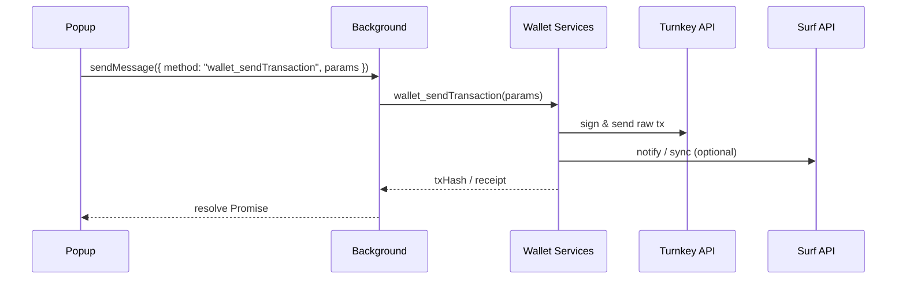

<!-- @format -->

# Surf Wallet

Surf Wallet 是一款浏览器钱包插件，基于 WXT + React 构建。

## 功能特性

- **现代化的技术栈**: 使用 WXT 和 React 构建，提供优秀的开发体验和性能。
- **强大的钱包功能**: 集成 [ethers.js](https://ethers.io/)，支持以太坊及兼容链的各种操作。
- **安全的密钥管理**: 使用 [@turnkey/sdk-browser](https://www.turnkey.com) 进行安全的密钥管理。
- **高度可定制**: 你可以轻松地在此模板的基础上进行二次开发，构建你自己的浏览器钱包。

## 准备工作

在开始之前，请确保你已经安装了以下工具：

- [Node.js](https://nodejs.org/) (版本 18 或更高)
- [pnpm](https://pnpm.io/)

## 安装

1.  克隆项目到本地:

    ```bash
    git clone https://github.com/your-username/surf-agent-wallet.git
    cd surf-wallet
    ```

2.  使用 pnpm 安装依赖:
    ```bash
    pnpm install
    ```

## 开发

执行以下命令以启动开发服务器:

```bash
pnpm dev
```

该命令会启动一个用于开发的浏览器实例，并自动加载插件。WXT 会监听文件变化并自动重新加载插件，为你提供流畅的开发体验。

如果你想为 Firefox 开发，可以执行:

```bash
pnpm dev:firefox
```

## 构建

执行以下命令来构建生产版本的插件:

```bash
pnpm build
```

构建产物会生成在 `.output/surf-wallet` 目录下。

如果你想为 Firefox 构建，可以执行:

```bash
pnpm build:firefox
```

### 打包插件

执行以下命令可以将构建好的插件打包为 `.zip` 文件，方便分发:

```bash
pnpm zip
```

打包产物会生成在 `.output` 目录下。

同样地，你也可以为 Firefox 打包:

```bash
pnpm zip:firefox
```

## 项目结构

```
.
├── entrypoints/      # 插件入口点 (popup, background, etc.)
├── public/           # 静态资源
├── styles/           # 样式文件
├── utils/            # 工具函数
├── package.json      # 项目依赖和脚本
├── wxt.config.ts     # WXT 配置文件
└── ...
```

## 架构与数据流

Surf Wallet 使用「Popup UI ↔ Background Service ↔ Wallet Services ↔ 外部 API」的典型浏览器插件分层架构。下面从两个维度（组件关系 & 时序）说明数据在各层之间的流向。

### 组件关系

1. **Popup（React）**  
   用户交互界面。通过 `browser.runtime.sendMessage` 向 Background 发送指令 (如获取余额、发起签名等)，并监听来自 Background 的响应以更新界面状态。

2. **Content Script / Inject Script**  
   向网页注入 `window.surf` 对象，供 DApp 调用。其请求同样经由 `browser.runtime.sendMessage` 发送给 Background，再由后者统一处理。

3. **Background**  
   插件核心逻辑所在。接收来自 Popup 和 Content Script 的消息，根据不同 `method` 调用相应的 **Wallet Services**，并把结果再回传给消息源。

4. **Wallet Services**

   - `TurnkeyService`：封装 [@turnkey/sdk-browser]，负责密钥管理、交易签名。
   - `surfApiService`：与 Surf 后端通信。
   - `KeyStoreService`：本地持久化加密存储用户凭证。  
     这些 Service 通过组合的方式被 Background 调用，不直接暴露给 UI 层。

5. **外部 API / 区块链网络**  
   包括 Turnkey API、Surf API 以及 EVM 兼容链节点。真正的链上交互在这里发生。

### 时序图示例

下面的时序图以「Popup 请求发送交易」为例，展示一次完整的数据流动过程：



> 其它诸如「获取余额」「批量签名」等流程与此类似，只是调用的 Service 方法及外部接口不同。

通过这种清晰的责任分层，Surf Wallet 能够在保证安全性的同时，实现高可扩展性与良好的用户体验。

## 主要依赖

- [wxt](https://wxt.dev/): 下一代浏览器插件开发工具
- [React](https://react.dev/): 用于构建用户界面的 JavaScript 库
- [ethers](https://docs.ethers.io/): 完整的以太坊钱包实现和工具库
- [@turnkey/sdk-browser](https://www.turnkey.com/): Turnkey 浏览器端 SDK
- [pnpm](https://pnpm.io/): 快速、节省磁盘空间的包管理器

## 贡献

欢迎提交 issue 或 pull request 来改进项目！

## 开源许可

[MIT](./LICENSE)
